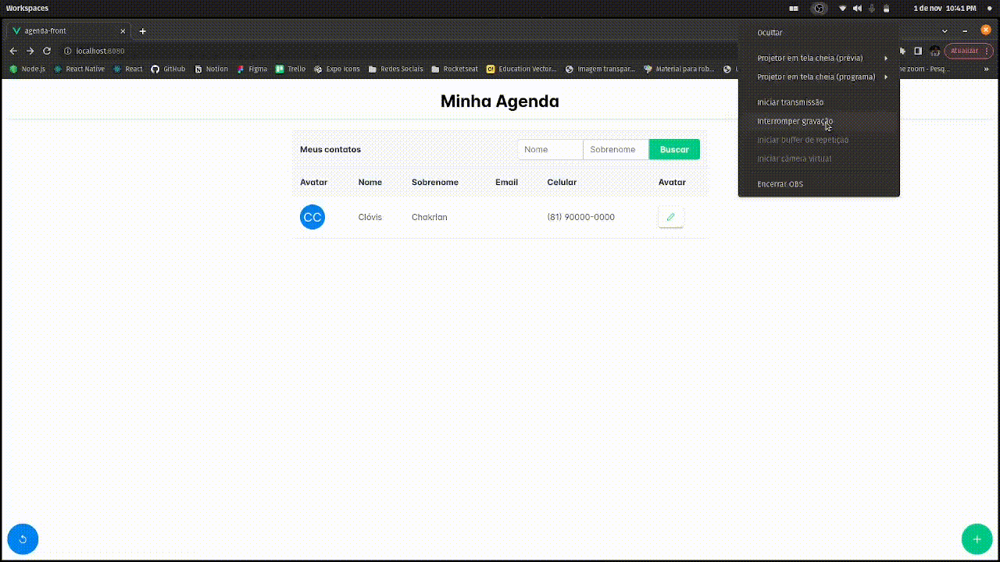

# Seja bem vindo! Me chamo Clóvis Chakrian

# Desafio Front End BlueTechnology

Estou participando do processo seletivo da Blue Technology e esse repositório contém o Front End da aplicação passada como desafio.
Trata-se de um CRUD ([clique aqui para o back](https://github.com/clovis-chakrian/Agenda-BackEnd-BlueTechnology)) para uma agenda de contatos e o front foi desenvolvido utilizando o framework `VueJs`. Nesse projeto foi utilizado, juntamento ao `VueJs`, `JS` e como biblioteca de componentes para agilizar o desenvolvimento, utilizei o `VuePrime`

## Funcionalidade

- Criação de contato
- Busca de contatos por nome + sobrenome
- Buscar todos os contatos
- Atualizar um contato
- Ver detalhes de um contato pelo seu id
- Deleter contato
- Validação de campos
- Tratamento de erros

## 📥 Como baixar e rodar

Antes de começar, é importante ter algumas ferramentas instaladas como o [Git](https://git-scm.com), um editor de códigos como o [VSCode](https://code.visualstudio.com/) e ter o [Node](https://nodejs.org/).

### 💻 Setup

```shell
# clonar repo
$ git clone git@github.com:Clovis-Chakrian/Agenda-FrontEnd-BlueTechnology.git

# entrar na pasta do projeto
$ cd Agenda-FrontEnd-BlueTechnology

# instalar dependencias
$ npm install
# OU
$ yarn

# rodar projeto
$ npm run serve
# OU
$ yarn serve
```

### Acessando

```shell
# A aplicação rodando
- Local: http://localhost:8080
```

## 🌐 [Aplicação Rodando](https://github.com/Clovis-Chakrian/Agenda-FrontEnd-BlueTechnology)



## Layout

### Desktop


### Mobile


## 🛠 Tech Stack

Stack utilizada para desenvolver o projeto:

<div align="left">
  

  

  

  

  

  
</div>

## ✍🏼 Autor do projeto

<div align=left>
  <table>
    <p>Desenvolvido com carinho por:</p>
    <tr align=center>
      <th>
        <strong> Clóvis Chakrian </strong>
      </th>
    </tr>
    <td>
      <a href="https://github.com/clovis-chakrian">
         
      </a>
    </td>
  </table>
</div>